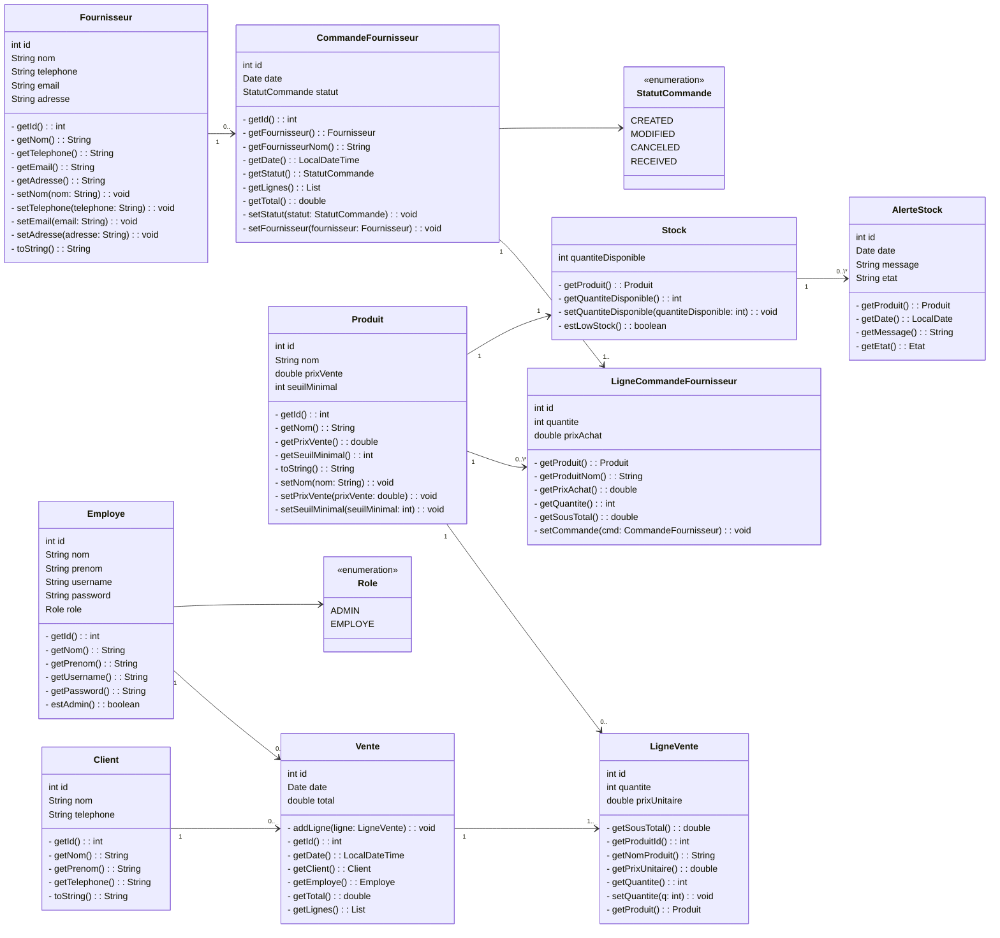

# Gestion Pharma - Système de gestion de pharmacie

Application de gestion de pharmacie en Java basée sur JavaFX et MySQL. Couvre l'inventaire, les ventes, les fournisseurs et le reporting.

## Pile technologique

| Composant       | Technologie | Version   |
| --------------- | ----------- | --------- |
| Framework GUI   | JavaFX      | 21.0.9    |
| Base de données | MySQL       | 9.5.0     |
| Outil de build  | Maven       | Latest    |
| Version Java    | Java SE     | 21        |
| Layout UI       | FXML        | XML-based |

## Structure du projet

```
gestion-pharma/
├── src/application/
│   ├── Main.java
│   ├── views/
│   │   ├── LoginController.java
│   │   ├── AdminController.java
│   │   ├── StockController.java
│   │   ├── VenteController.java
│   │   ├── FournisseursController.java
│   │   └── HistoriqueController.java
│   ├── modeles/
│   │   ├── Produit.java
│   │   ├── Client.java
│   │   ├── Employe.java
│   │   ├── Fournisseur.java
│   │   ├── CommandeFournisseur.java
│   │   ├── Vente.java
│   │   ├── Stock.java
│   │   ├── LigneVente.java
│   │   ├── LigneCommandeFournisseur.java
│   │   ├── StatutCommande.java
│   │   └── AlerteStock.java
│   ├── dao/
│   │   ├── ProduitDAO.java
│   │   ├── ClientDAO.java
│   │   ├── EmployeeDAO.java
│   │   ├── FournisseurDAO.java
│   │   ├── StockDAO.java
│   │   ├── VenteDAO.java
│   │   ├── CommandeFournisseurDAO.java
│   │   └── LigneCommandeFournisseurDAO.java
│   ├── services/
│   │   ├── AuthService.java
│   │   ├── DataService.java
│   │   ├── SecurityUtils.java
│   │   ├── StockMoniteur.java
│   │   └── reports/
│   │       ├── ChiffreAffaires.java
│   │       ├── EtatStock.java
│   │       └── PerformanceFournissuers.java
│   ├── exceptions/
│   │   ├── AccesRefuseException.java
│   │   ├── CommandeInvalideException.java
│   │   └── StockInsuffisantException.java
│   ├── resources/
│   │   └── DatabaseConnection.java
│   └── database/
│       └── console.sql
└── pom.xml
```

## Fonctionnalités

### Authentification

- Système de connexion avec hachage de mot de passe
- Contrôle d'accès par rôle (Admin, Employé)

### Gestion de stock

- Suivi d'inventaire en temps réel
- Alertes de stock bas
- Validation de stock pour éviter le survente

### Ventes

- Transactions de vente avec lignes d'articles
- Suivi des clients
- Historique des ventes

### Gestion des fournisseurs

- Informations et contacts fournisseurs
- Bons de commande avec suivi de statut (CREATED, MODIFIED, CANCELED, RECEIVED)
- Mise à jour automatique du stock à la réception des commandes

### Reporting

- Analyse du chiffre d'affaires
- Rapports d'état des stocks
- Indicateurs de performance fournisseurs

### Contrôle de concurrence

- Mutex à base de sémaphore pour des transactions thread-safe
- Politique d'accès équitable FCFS

## Prérequis

- Java 21 ou supérieur
- Serveur MySQL
- Maven

## Installation

1. Configurer la connexion BD dans `src/application/resources/DatabaseConnection.java`
2. Créer le schéma BD depuis `src/application/database/console.sql`
3. Build : `mvn clean install`
4. Run : `mvn javafx:run`

## Architecture

L'application suit une architecture MVC en trois couches :

- Couche présentation : contrôleurs JavaFX et layouts FXML
- Couche logique métier : services (AuthService, DataService, etc.)
- Couche accès données : DAOs pour toutes les entités
- Couche base de données : MySQL

## Tables de base de données

- employe - Personnel
- client - Informations client
- produit - Catalogue de produits/médicaments
- stock - Niveaux d'inventaire
- fournisseur - Informations fournisseur
- commande_fournisseur - Bons de commande
- vente - Transactions de vente
- ligne_vente - Lignes de vente
- ligne_commande_fournisseur - Lignes de commande fournisseur

### Class diagram



## Sécurité

- Hachage des mots de passe via SecurityUtils
- Requêtes préparées dans tous les DAO pour éviter l'injection SQL
- Contrôle d'accès basé sur les rôles
- Gestion d'erreurs via exceptions personnalisées

## Gestion des exceptions

- AccesRefuseException - Identifiants de connexion invalides
- CommandeInvalideException - Opérations de commande invalides
- StockInsuffisantException - Stock insuffisant pour la vente
